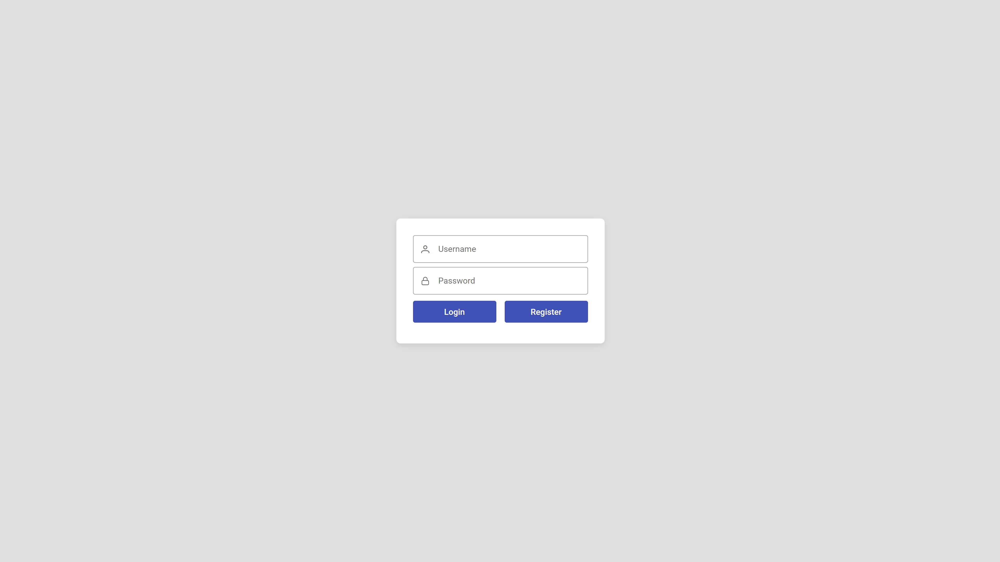
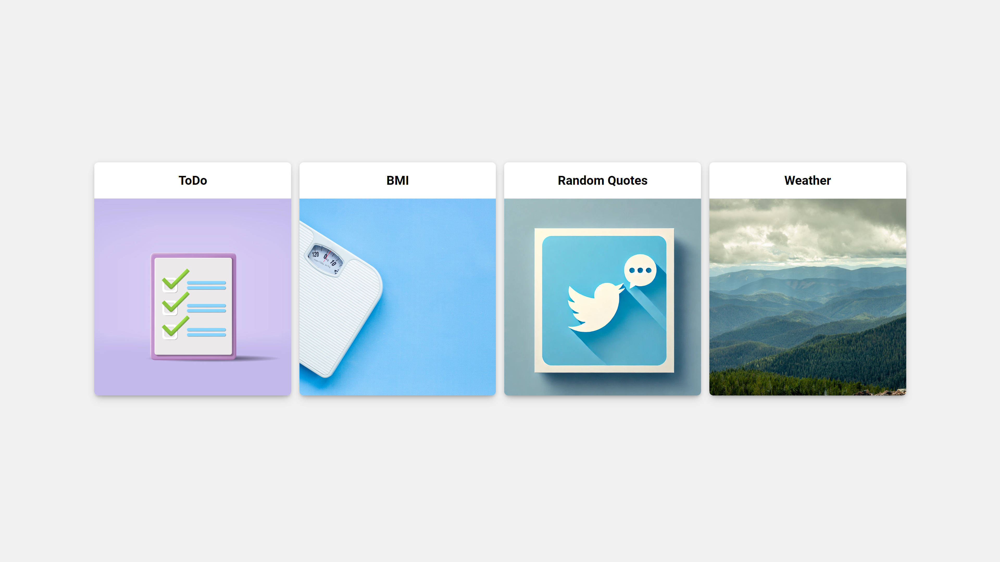
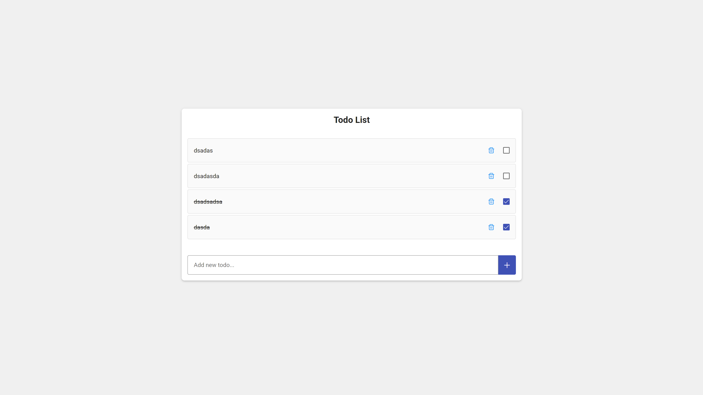
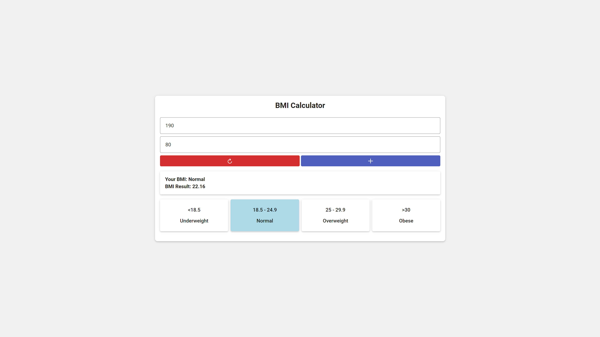
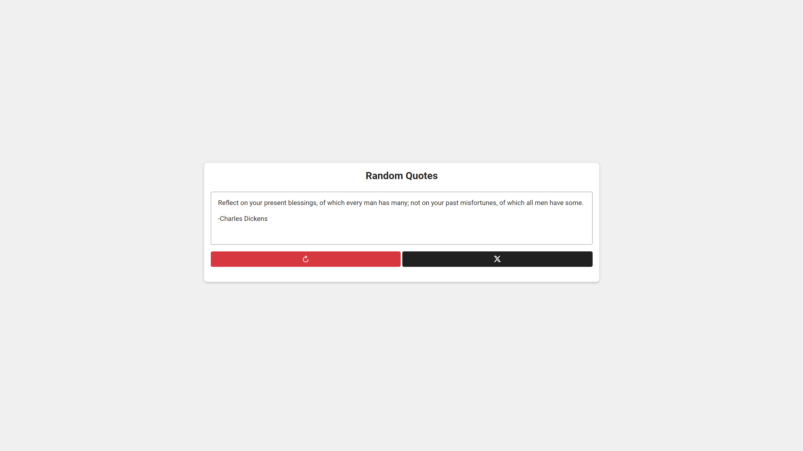
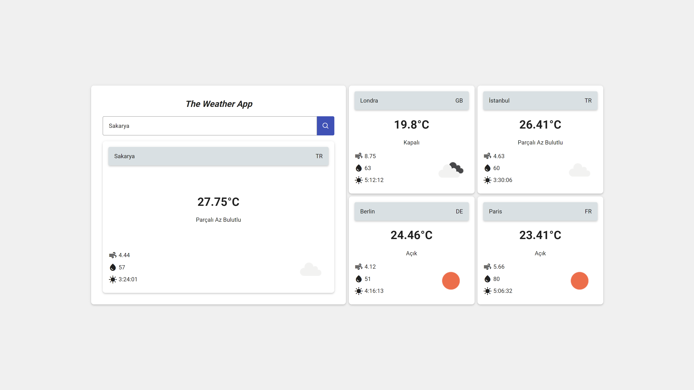

# Uygulama Havuzu Client

- Sakarya Büyükşehir Belediyesi Bilgi İşlem Dairesinde yaptığım zorunlu stajımda verilen Junior .NET Geliştirici Ödev Projesi'nin Front-End tarafını tamamlamış bulunmaktayım.

## Uygulamalar:

- Auth: JWT Giriş/Kayıt İşlemleri
- Todo: Yapılacaklar Listesi
- BMI: Vücut Kitle Endeksi Hesaplama
- Random Quotes: Twitter'da Rastgele Söz Paylaşma
- Weather: Anlık Hava Durumu

## Kurulum:

    git clone https://github.com/cusufcan/uygulama_havuzu_client

## Ekran Görüntüleri:

<table>
    <tr><td></td></tr>
    <tr><td></td></tr>
    <tr><td></td></tr>
    <tr><td></td></tr>
    <tr><td></td></tr>
    <tr><td></td></tr>
</table>

## Kullanılan Teknolojiler:

- HTML & CSS & TypeScript
- Angular Framework
- PrimeNG
- PrimeFlex
- PrimeIcons
- Onion Architecture
- JWT Bearer
- AJAX CRUD
- HTTP Client
- Material Icons

## Lisans:

    MIT
